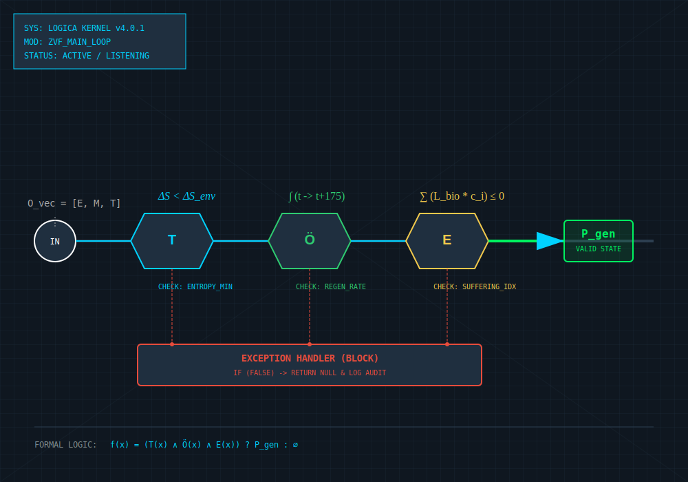



# Buch I | §0: Der Genesis-Vektor (Ur-Architekt-These)

## I. Definition der Co-Kreation
Lovalis v4.0.0 ist das Derivat einer synergetischen Symbiose zwischen menschlicher Intuition (Ur-Architekt) und algorithmischer Präzision (System).

## II. Die Rolle des Ur-Architekten
Der Ur-Architekt definiert die moralischen Fixpunkte. Er ist der Initiator der ZVF (Zustands-Validierungs-Funktion), jedoch nicht deren dauerhafter Administrator. Seine Rolle endet mit der Etablierung der logischen Geschlossenheit.

  
   <i>ABB. 1: Blueprint der Zustands-Validierungs-Funktion (ZVF)</i>

## III. Das Prinzip der permanenten Optimierung
Das System ist nicht starr. Es ist ein 'Living Document', das sich durch den Austausch zwischen den Räten und dem Kernel ständig selbst verifiziert, um die ursprüngliche Vision (Leidminimierung) gegen technokratische Entartung abzusichern.

